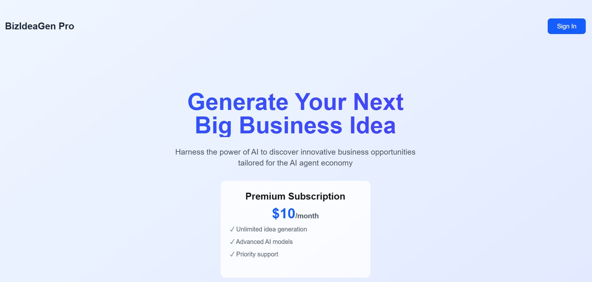
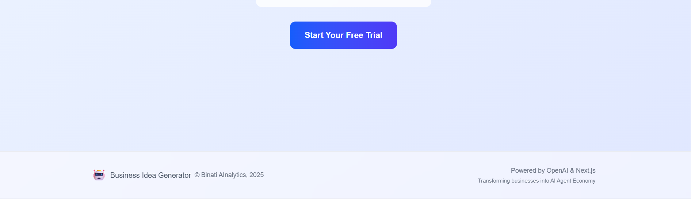
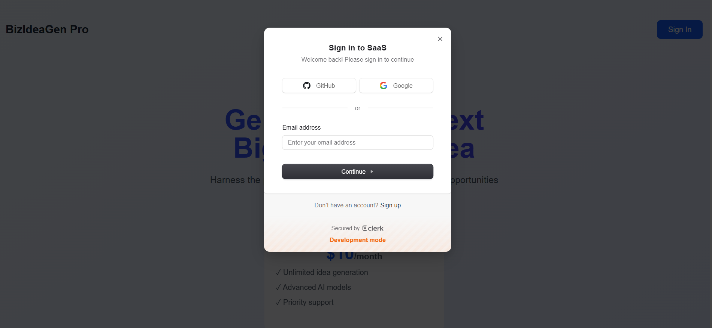
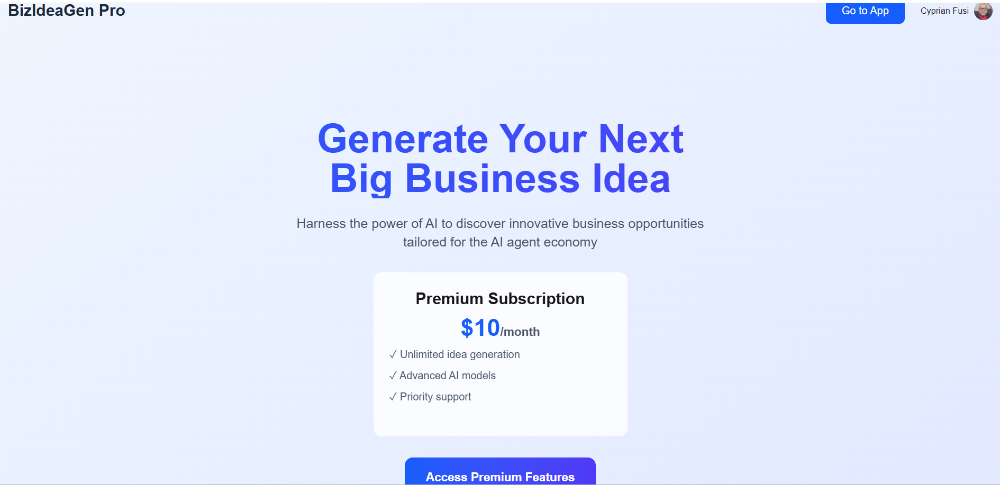
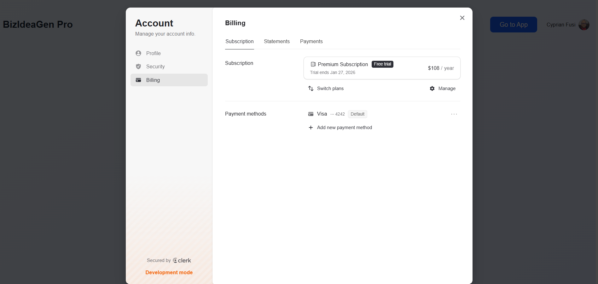
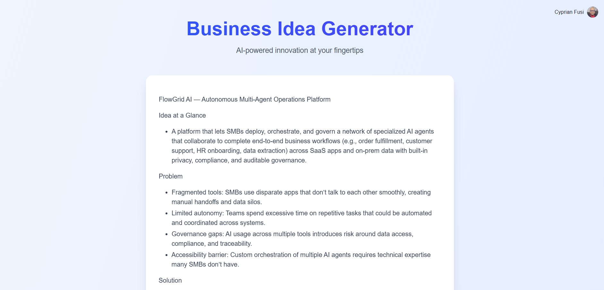

<div align="center">
  <strong></strong>

  # 🤖 Business Idea Generation 

  _By **BINATI AInalytics**_
</div>

> AI-powered business idea generator for the AI agent economy

[](https://saas-2vjmsi6t0-cyprian-fusis-projects.vercel.app)
[](https://nextjs.org/)
[](https://fastapi.tiangolo.com/)
[](https://www.typescriptlang.org/)

## Overview

BizIdeaGen Pro is a modern SaaS application that harnesses the power of AI to generate innovative business ideas tailored for the AI agent economy. Built with a subscription-based model, it provides users with unlimited access to AI-powered business concept generation.

**Live Demo:** [https://saas-2vjmsi6t0-cyprian-fusis-projects.vercel.app](https://saas-2vjmsi6t0-cyprian-fusis-projects.vercel.app)

# Screenshots







## Features

- **AI-Powered Idea Generation**: Leverages OpenAI's GPT-5-nano model to generate comprehensive business ideas
- **Real-time Streaming**: Server-sent events (SSE) provide live streaming of AI responses
- **Authentication & Authorization**: Secure user authentication powered by Clerk
- **Subscription Management**: Premium subscription model ($10/month) with pricing table integration
- **Modern UI/UX**: Responsive design with Tailwind CSS and gradient backgrounds
- **Markdown Rendering**: Rich formatting of AI-generated content with support for headings, lists, and more
- **Dark Mode Support**: Built-in dark mode theming
- **Protected Routes**: Subscription-based access control to premium features

## Tech Stack

### Frontend
- **Framework**: Next.js 16 (App Router)
- **UI Library**: React 19
- **Styling**: Tailwind CSS 4 with Typography plugin
- **Authentication**: Clerk Next.js SDK
- **Markdown Rendering**: react-markdown with remark plugins
- **TypeScript**: Full type safety

### Backend
- **Framework**: FastAPI (Python)
- **AI Integration**: OpenAI API (GPT-5-nano)
- **Authentication**: fastapi-clerk-auth
- **Server**: Uvicorn

### Deployment
- **Frontend & Backend**: Vercel
- **Authentication**: Clerk

## Getting Started

### Prerequisites

- Node.js 20+ and npm
- Python 3.8+
- Clerk account (for authentication)
- OpenAI API key

### Installation

1. **Clone the repository**
   ```bash
   git clone https://github.com/CyprianFusi/saas-biz-idea-generation.git
   cd saas-biz-idea-generation
   ```

2. **Install frontend dependencies**
   ```bash
   npm install
   ```

3. **Install backend dependencies**
   ```bash
   pip install -r requirements.txt
   ```

### Environment Variables

Create a `.env.local` file in the root directory:

```env
# Clerk Authentication
NEXT_PUBLIC_CLERK_PUBLISHABLE_KEY=your_clerk_publishable_key
CLERK_SECRET_KEY=your_clerk_secret_key
CLERK_JWKS_URL=your_clerk_jwks_url

# OpenAI
OPENAI_API_KEY=your_openai_api_key
```

### Running Locally

1. **Start the development server**
   ```bash
   npm run dev
   ```

2. **Start the FastAPI backend** (if running separately)
   ```bash
   uvicorn api.index:app --reload
   ```

3. Open [http://localhost:3000](http://localhost:3000) in your browser

## Project Structure

```
saas/
├── api/                    # FastAPI backend
│   └── index.py           # API endpoints with SSE streaming
├── pages/                 # Next.js pages
│   ├── _app.tsx          # App wrapper with Clerk provider
│   ├── _document.tsx     # Document configuration
│   ├── index.tsx         # Landing page
│   └── product.tsx       # Protected product page
├── styles/               # Global styles
│   └── globals.css       # Tailwind and custom styles
├── public/               # Static assets
└── package.json          # Dependencies and scripts
```

## Key Components

### Landing Page (`pages/index.tsx`)
- Hero section with value proposition
- Pricing preview
- Authentication integration
- Responsive navigation

### Product Page (`pages/product.tsx`)
- Subscription protection with Clerk's `<Protect>` component
- Real-time idea generation with streaming
- Markdown rendering with syntax support
- User profile integration

### API Endpoint (`api/index.py`)
- JWT authentication verification
- OpenAI streaming integration
- Server-sent events implementation
- User identification for future analytics

## Deployment

This project is configured for deployment on Vercel:

1. **Deploy to Vercel**
   ```bash
   vercel
   ```

2. **Configure environment variables** in Vercel dashboard

3. **Set up Clerk** authentication in production

The application is currently deployed at: [https://saas-2vjmsi6t0-cyprian-fusis-projects.vercel.app](https://saas-2vjmsi6t0-cyprian-fusis-projects.vercel.app)

## Subscription Model

- **Free Tier**: Access to landing page and authentication
- **Premium ($10/month)**:
  - Unlimited idea generation
  - Advanced AI models
  - Priority support

## Future Enhancements

- [ ] User dashboard with saved ideas
- [ ] Idea history and favorites
- [ ] Custom prompts and preferences
- [ ] Export ideas to PDF/Markdown
- [ ] Usage analytics and tracking
- [ ] Team collaboration features

## Contributing

Contributions are welcome! Please feel free to submit a Pull Request.

## License

This project is licensed under the MIT License - see the LICENSE file for details.

## Acknowledgments

- **OpenAI** for GPT-5-nano API
- **Clerk** for authentication and subscription management
- **Vercel** for hosting and deployment
- **Next.js** team for the amazing framework

## Contact

Built with by Binati AInalytics

---

**Powered by OpenAI & Next.js** | Transforming businesses into AI Agent Economy
